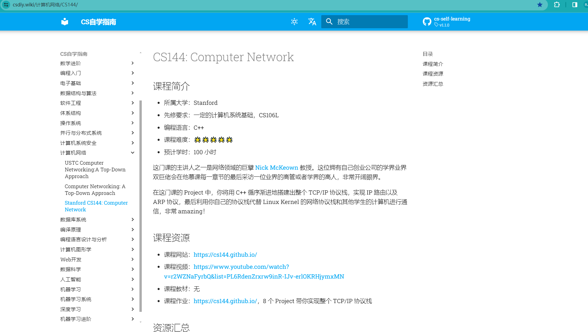
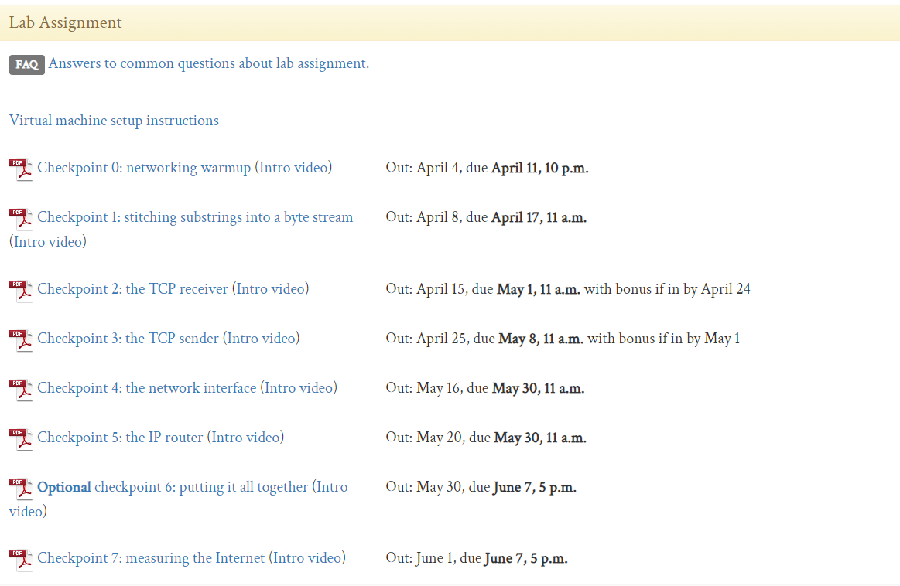
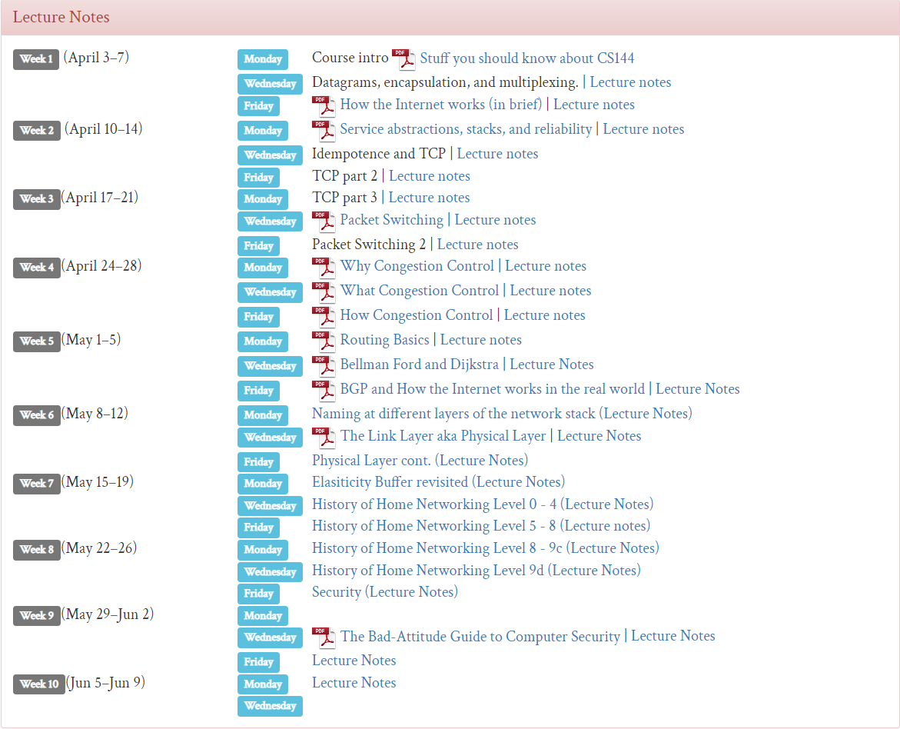

# 2023年CS144课程学习资料备份

这里截取一段CS自学指南对CS144课程的介绍

由于我当时做的是2023版本的, 相关的课程资源大多是前些年的, 因此把比较新的资料备份下来了

## 备份的内容

### lab_assignment

### lecture_notes

### 虚拟机

虚拟机太大了, 下载太慢, 就不备份了, 可以直接在自己的Linux主机/虚拟机上安装C++20的工具链: 

`Use your own GNU/Linux installation with a C++20 compiler (GCC 13 or later, clang 16 or later)`

安装好之后克隆仓库, 然后按照`lab_assignment`中的内容去做就好了.

## 个人建议

分支finished是我完成这个实验的解决方案, 对于当时的我来说做完这个老费劲了. **在你通过100%的测试之前, 请不要查看任何已有的解决方案, 一定要读懂lab assignment再开始做.**

### 新手与老手

如果是没学过计算机网络的新手, 或者是上课没听, 或者是全忘干净了, 想要深入理解TCP/IP协议栈那做这个Lab真的是最赚的.  推荐看一章节的[课程视频](https://www.youtube.com/watch?v=r2WZNaFyrbQ&list=PL6RdenZrxrw9inR-IJv-erlOKRHjymxMN), 然后做一个Lab, 最后课也看完了, Lab也做出来了. 推荐找一些大段的空闲时间,  然后一口气把它做出来

如果是老手的话, 已经了解相关的知识, 对自己的编程能力比较自信, 也可也直接看Lab就开始做, 课程中的内容本身和编程实现关系不大, 直接做效率比较高. 在完成Lab之外, 代码的架构和测试用例都是不错的学习资源. 

### 做不出来怎么办

如果你觉得该实验非常困难, 卡住卡了好久, 可以**多读几次lab assignment**, **把自己的思路画成图**, 现在纸上推演出整个过程.  **画图真的非常有用**, 画自己能看得懂的图, 不仅非常快, 而且能够帮助意识到很多边界问题.

做的快的话个把小时就做完了, 好多大神都是很快就做完的, 然后感觉没什么...

做的慢的比如说我, 得好几个小时才做得完, 做的快的几个小时做完, 做得慢的要十几个小时, 写出的代码可能看起来也不是那么优雅...... 我之前还做过一个类似的操作系统的Lab,  一开始根本就做不出来, 后来做的快的十几个小时, 做得慢的一两天, 写出来的代码甚至看起来比较丑陋......  一开始做得慢是正常的, 多迭代几次就快了.

### 关于使用ChatGPT:

#### 推荐使用的方式:

- 帮助你的代码生成一些打印的语句

  自己手动添加打印的语句可能比较麻烦, 可以让chatgpt帮忙打印一些变量啥的, 可以少敲一些字, 比较方便

- 询问C++的语法

  比如说我知道python和c语言相关的语法, 看看cpp有没有类似的语法, chatgpt这个时候可以生成出一些简单的例子, 也可也给出对应的官方文档, 比直接去官方文档上查字典快很多. 不过还是推荐看官方文档, 没有任何内容能够代替官方文档.

#### 不推荐的使用方式:

- 询问解决方案

  ChatGPT基本上不能解决逻辑复杂的问题, 并且会误导你走上错误的道路...... 我当时在某个地方卡住了, 几个小时都解决不出来, 差点心态崩了, 问ChatGPT, 发现它开始胡扯......, 后来静下心来重新把整个流程画图化了一遍, 找到了问题的原因. 即使它不胡扯, 如果直接生成出了正确的解决方案, 那就像未完成前查看他人的解决方案一样了.